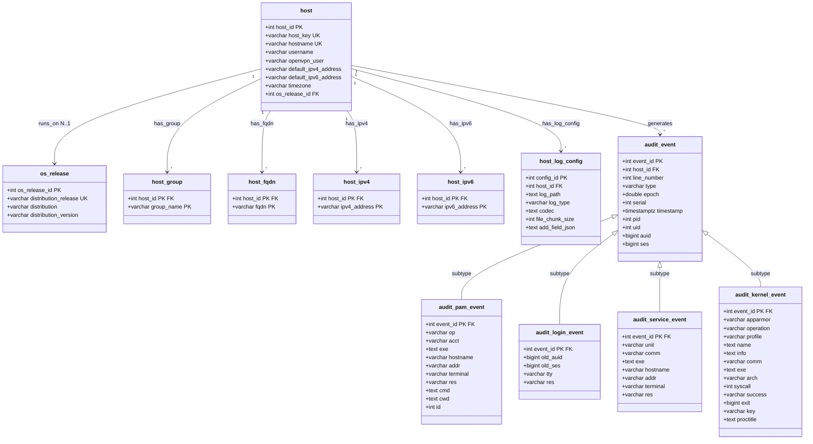

# 3NF Data Model

Source notebooks: `01_explore_hosts.ipynb`, `05_explore_audit_intranet.ipynb`, `07_explore_audit_internal_share.ipynb`.
EER diagram (Chen): `docs/er_diagrams/combined_eer_3nf_v1.drawio.xml`.
Normalization spec: `docs/schema/normalization_raw_to_3nf.md`.

**Status:**
- Host domain (sections 2.1-2.7): **Finalized.** Design decisions resolved in DAT-59.
- Audit domain (sections 2.8-2.12): **Preliminary design.** Needs verification before implementation.

---

## 1. Source Files

| # | Notebook | Source path (under russellmitchell/) | Staging table | Rows | Cols | Domain |
|---|---|---|---|---|---|---|
| 1 | 01 | `processing/config/servers.yaml` | `stg_host_raw` | 22 | 15 | Host inventory (all 22 testbed machines) |
| 2 | 01 | (nested in #1) | `stg_host_log_config_raw` | 66 | 7 | Host log configurations |
| 3 | 05 | `gather/intranet_server/logs/audit/audit.log` | `stg_audit_line_raw` | 2,316 | 44 | Linux auditd-privilege escalation context |
| 4 | 07 | `gather/internal_share/logs/audit/audit.log` | `stg_audit_line_raw` | 732 | 44 | Linux auditd-data exfiltration context |

Source 3 and 4 use the same auditd format and share a single staging table (`stg_audit_line_raw`, 3,048 rows total), discriminated by `source_host`.

---

## 2. Entity Catalog

### 2.1 os_release

3NF lookup entity. Resolves transitive dependency: `distribution_release -> distribution, distribution_version`. Row grain: one row per OS release.

| Attribute | Type | Constraint | Notes |
|---|---|---|---|
| os_release_id | SERIAL | PK | Surrogate key |
| distribution_release | VARCHAR(20) | UNIQUE, NOT NULL | Natural key; "bionic" or "stretch" (determinant) |
| distribution | VARCHAR(50) | NOT NULL | "Ubuntu" or "Debian" |
| distribution_version | VARCHAR(20) | NOT NULL | "18.04" or "9.11" |

2 rows total. `distribution_release` is the natural key (candidate key).

### 2.2 host

Central reference entity. Every machine in the AIT testbed. Row grain: one row per host.

`host_key` is the downstream integration key: it aligns with `stg_audit_line_raw.source_host` and `stg_attack_label_line_raw.source_host`, enabling FK resolution when loading other domains into 3NF.

| Attribute | Type | Constraint | Notes |
|---|---|---|---|
| host_id | SERIAL | PK | Surrogate key |
| host_key | VARCHAR(50) | UNIQUE, NOT NULL | YAML dict key (e.g. "intranet_server"); integration key for cross-domain FK resolution |
| hostname | VARCHAR(100) | UNIQUE, NOT NULL | Machine hostname |
| username | VARCHAR(50) | nullable | Only 7 employee hosts |
| openvpn_user | VARCHAR(50) | nullable | Only 3 remote employees |
| default_ipv4_address | VARCHAR(45) | NOT NULL | Single-valued; always 1 per host. Must also exist in `host_ipv4` for same host. |
| default_ipv6_address | VARCHAR(45) | NOT NULL | Single-valued; always 1 per host. Must also exist in `host_ipv6` for same host. |
| timezone | VARCHAR(10) | NOT NULL | "UTC" for all 22 hosts (retained as source data) |
| os_release_id | INT | FK -> os_release, NOT NULL | 3NF lookup |

22 rows total.

### 2.3 host_group

1NF junction entity (M:N). Decomposes multi-valued `groups` field.

| Attribute | Type | Constraint | Notes |
|---|---|---|---|
| host_id | INT | PK, FK -> host | |
| group_name | VARCHAR(50) | PK | 17 distinct groups (attacker, servers, dmz, employee, ...) |

Composite PK (host_id, group_name). Each host has 2-5 groups.

63 rows total.

### 2.4 host_fqdn

1NF child entity (1:N). Decomposes multi-valued `fqdns` field.

| Attribute | Type | Constraint | Notes |
|---|---|---|---|
| host_id | INT | PK, FK -> host | |
| fqdn | VARCHAR(255) | PK | 0-4 FQDNs per host |

Composite PK (host_id, fqdn). 7 hosts have 0 FQDNs (NULL in staging -> no rows here).

20 rows total.

### 2.5 host_ipv4

1NF child entity (1:N). Decomposes multi-valued `ipv4_addresses` field.

| Attribute | Type | Constraint | Notes |
|---|---|---|---|
| host_id | INT | PK, FK -> host | |
| ipv4_address | VARCHAR(45) | PK | 21/22 hosts have 1; inet-firewall has 3 |

Composite PK (host_id, ipv4_address).

24 rows total.

### 2.6 host_ipv6

1NF child entity (1:N). Decomposes multi-valued `ipv6_addresses` field.

| Attribute | Type | Constraint | Notes |
|---|---|---|---|
| host_id | INT | PK, FK -> host | |
| ipv6_address | VARCHAR(45) | PK | Same cardinality pattern as ipv4 |

Composite PK (host_id, ipv6_address).

24 rows total.

### 2.7 host_log_config

Child entity (weak entity in EER). Composite+multi-valued `logs` field already separated during staging. Row grain: one row per log config per host.

| Attribute | Type | Constraint | Notes |
|---|---|---|---|
| config_id | SERIAL | PK | Surrogate key |
| host_id | INT | FK -> host, NOT NULL | |
| log_path | TEXT | NOT NULL | e.g. "/var/log/audit/audit.log" |
| log_type | VARCHAR(50) | NOT NULL | 11 distinct types |
| codec | TEXT | nullable | String or JSON-serialized dict |
| file_chunk_size | INT | nullable | |
| add_field_json | TEXT | nullable | Practical exception: opaque JSON payload retained as-is (not fully normalized) |

UNIQUE constraint on (host_id, log_path)-candidate business key, verified unique in current data.

66 rows total (1-9 configs per host).

---

## NEEDS VERIFICATION / PRELIMINARY DESIGN

The entities below (2.8-2.12) are preliminary designs from initial exploration. They need verification and finalization before implementation, similar to the process completed for the host domain above.

---

### 2.8 audit_event (supertype)-PRELIMINARY

Common attributes shared by all audit log event types. Both intranet_server and internal_share rows load into this single table, discriminated by `host_id`.

| Attribute | Type | Constraint | Notes |
|---|---|---|---|
| event_id | SERIAL | PK | Surrogate key |
| host_id | INT | FK -> host, NOT NULL | Links to source host via `host.host_key` |
| line_number | INT | NOT NULL | Line in source file (unique per host) |
| type | VARCHAR(20) | NOT NULL | Discriminator (15 distinct across both files) |
| epoch | DOUBLE PRECISION | NOT NULL | Unix timestamp with ms |
| serial | INT | NOT NULL | auditd serial number |
| timestamp | TIMESTAMPTZ | NOT NULL | Derived from epoch (dashed oval in EER) |
| pid | INT | nullable | Process ID |
| uid | INT | nullable | User ID |
| auid | BIGINT | nullable | Audit UID (4294967295 = unset sentinel) |
| ses | BIGINT | nullable | Session ID (4294967295 = unset sentinel) |

3,048 rows total (2,316 from intranet + 732 from internal_share).
Unique constraint on (host_id, line_number) serves as a natural composite key.

### 2.9 audit_pam_event (subtype)-PRELIMINARY

PAM-related event types. Attributes are unpacked from the `msg` TEXT blob (1NF fix).

| Attribute | Type | Constraint | Notes |
|---|---|---|---|
| event_id | INT | PK, FK -> audit_event | Shared key with supertype |
| op | VARCHAR(30) | nullable | PAM operation (e.g. PAM:accounting, PAM:setcred) |
| acct | VARCHAR(50) | nullable | Account name |
| exe | TEXT | nullable | Executable path |
| hostname | VARCHAR(50) | nullable | PAM hostname field (not the host entity hostname) |
| addr | VARCHAR(50) | nullable | Source address ("?" or IP) |
| terminal | VARCHAR(30) | nullable | Terminal (cron, ssh, pts0, ...) |
| res | VARCHAR(20) | nullable | Result ("success") |
| cmd | TEXT | nullable | Hex-encoded command (USER_CMD only, 1 event) |
| cwd | TEXT | nullable | Working directory (USER_CMD only) |
| id | INT | nullable | User ID in msg (USER_CMD only) |

Event types: USER_ACCT, CRED_ACQ, USER_START, USER_END, CRED_DISP, USER_AUTH, CRED_REFR, USER_LOGIN, USER_CMD.
~2,540 rows (83% of all events). Dominant category.

Note: cmd, cwd, id are specific to USER_CMD (1 event in intranet, 0 in internal_share). They are nullable columns on this subtype rather than a separate subtype due to minimal occurrence.

### 2.10 audit_login_event (subtype)-PRELIMINARY

LOGIN kernel events. Attributes are top-level fields (not from msg blob).

| Attribute | Type | Constraint | Notes |
|---|---|---|---|
| event_id | INT | PK, FK -> audit_event | |
| old_auid | BIGINT | nullable | Always 4294967295 in this dataset |
| old_ses | BIGINT | nullable | Always 4294967295 |
| tty | VARCHAR(30) | nullable | "(none)" for LOGIN |
| res | VARCHAR(10) | nullable | "1" (numeric success) |

Event types: LOGIN.
410 rows (304 intranet + 106 internal_share).

### 2.11 audit_service_event (subtype)-PRELIMINARY

Systemd service lifecycle events. Attributes unpacked from `msg` blob (1NF fix).

| Attribute | Type | Constraint | Notes |
|---|---|---|---|
| event_id | INT | PK, FK -> audit_event | |
| unit | VARCHAR(100) | nullable | Service unit name (e.g. apt-daily, ssh, **put**) |
| comm | VARCHAR(50) | nullable | Command ("systemd") |
| exe | TEXT | nullable | Executable path |
| hostname | VARCHAR(50) | nullable | Always "?" in this dataset |
| addr | VARCHAR(50) | nullable | Always "?" |
| terminal | VARCHAR(30) | nullable | Always "?" |
| res | VARCHAR(20) | nullable | "success" |

Event types: SERVICE_START, SERVICE_STOP.
555 rows (471 intranet + 84 internal_share). The 2 attack events (unit=put, dnsteal exfiltration) are SERVICE_START/SERVICE_STOP in this subtype.

### 2.12 audit_kernel_event (subtype)-PRELIMINARY

Kernel-level events (AppArmor, syscall, proctitle). Attributes are top-level fields.

| Attribute | Type | Constraint | Notes |
|---|---|---|---|
| event_id | INT | PK, FK -> audit_event | |
| apparmor | VARCHAR(20) | nullable | AVC only |
| operation | VARCHAR(30) | nullable | AVC only |
| profile | VARCHAR(50) | nullable | AVC only |
| name | TEXT | nullable | AVC only |
| info | TEXT | nullable | AVC only |
| comm | VARCHAR(50) | nullable | AVC, SYSCALL |
| exe | TEXT | nullable | SYSCALL only |
| arch | VARCHAR(20) | nullable | SYSCALL only |
| syscall | INT | nullable | SYSCALL only |
| success | VARCHAR(5) | nullable | SYSCALL only |
| exit | BIGINT | nullable | SYSCALL only |
| key | VARCHAR(20) | nullable | SYSCALL only |
| proctitle | TEXT | nullable | PROCTITLE only (hex-encoded) |

Event types: AVC, SYSCALL, PROCTITLE.
24 rows (12 intranet + 12 internal_share). All are AppArmor profile_replace events for dhclient, not attack-related.

Note: Within this subtype, AVC/SYSCALL/PROCTITLE each populate different columns. This is residual sparsity within the subtype. Creating 3 separate sub-subtypes for 8 rows each was judged as over-engineering.

---

## 3. Relationships

| Relationship | From | To | Cardinality | Participation | Notes |
|---|---|---|---|---|---|
| runs_on | host | os_release | N:1 | total (host) : partial (os_release) | Every host has exactly 1 OS release |
| has_group | host | host_group | 1:N (M:N) | total : total | Every host has 2-5 groups; M:N bridge |
| has_fqdn | host | host_fqdn | 1:N | partial : total | Some hosts have 0 FQDNs |
| has_ipv4 | host | host_ipv4 | 1:N | total : total | Every host has at least 1 |
| has_ipv6 | host | host_ipv6 | 1:N | total : total | Every host has at least 1 |
| has_log_config | host | host_log_config | 1:N | total : total | Every host has 1-9 log configs |
| generates | host | audit_event | 1:N | partial : total | Only 2 of 22 hosts have audit logs in scope (PRELIMINARY) |
| specializes | audit_event | subtypes | total, disjoint |-| Every event is exactly 1 subtype (PRELIMINARY) |

The **generates** relationship is the cross-domain bridge: it connects the host inventory (notebook 01) to the audit events (notebooks 05, 07). The FK `audit_event.host_id` references `host.host_id`. When loading, each audit source file is mapped to its host_id via `host.host_key = stg_audit_line_raw.source_host`.

The **specializes** relationship is a total, disjoint EER specialization. The `type` attribute on audit_event determines which subtype table holds the row's type-specific fields. Every audit_event row has exactly one corresponding row in exactly one subtype table.

---

## 4. Entity Counts

### Host Domain (Finalized)

| Entity | Expected rows | Source |
|---|---|---|
| os_release | 2 | Derived from hosts (2 distinct OS releases) |
| host | 22 | servers.yaml |
| host_group | 63 | 22 hosts x 2-5 groups each (sum of all memberships) |
| host_fqdn | 20 | 7 hosts x 0 + 12 x 1 + 2 x 2 + 1 x 4 |
| host_ipv4 | 24 | 21 hosts x 1 + inet-firewall x 3 |
| host_ipv6 | 24 | Same pattern as ipv4 |
| host_log_config | 66 | 22 hosts x 1-9 configs |

### Audit Domain (Preliminary)

| Entity | Expected rows | Source |
|---|---|---|
| audit_event | 3,048 | 2,316 + 732 |
| audit_pam_event | ~2,540 | PAM event types |
| audit_login_event | 410 | LOGIN events |
| audit_service_event | 555 | SERVICE_START + SERVICE_STOP |
| audit_kernel_event | 24 | AVC + SYSCALL + PROCTITLE |

Subtype counts above are preliminary estimates. The 4 subtypes are intended to be exhaustive and disjoint over the 15 event types, but exact per-subtype row counts have not yet been verified. Final counts must be validated during implementation to confirm they sum to the audit_event total (3,048).

---

## 5. Loading Order (FK Dependencies)

### Host Domain (Finalized)

1. `os_release` (2 rows, no FK dependencies)
2. `host` (22 rows, FK -> os_release)
3. `host_group`, `host_fqdn`, `host_ipv4`, `host_ipv6`, `host_log_config` (FK -> host; can load in parallel)

### Audit Domain (Preliminary)

4. `audit_event` (FK -> host)
5. `audit_pam_event`, `audit_login_event`, `audit_service_event`, `audit_kernel_event` (FK -> audit_event; can load in parallel)

---

## 6. UML Class Diagram



---

## 7. How to Query Across Domains

Get host with its groups and OS release:

```sql
SELECT h.hostname, r.distribution, r.distribution_version, hg.group_name
FROM host h
JOIN os_release r ON h.os_release_id = r.os_release_id
JOIN host_group hg ON h.host_id = hg.host_id
WHERE h.host_key = 'intranet_server';
```

Filter audit events by source host (PRELIMINARY-audit schema not yet finalized):

```sql
SELECT ae.event_id, ae.type, ae.timestamp, ape.op, ape.acct
FROM audit_event ae
JOIN audit_pam_event ape ON ae.event_id = ape.event_id
JOIN host h ON ae.host_id = h.host_id
WHERE h.host_key = 'intranet_server';
```

Find the exfiltration service events (PRELIMINARY):

```sql
SELECT ae.event_id, ae.type, ae.timestamp, ase.unit
FROM audit_event ae
JOIN audit_service_event ase ON ae.event_id = ase.event_id
JOIN host h ON ae.host_id = h.host_id
WHERE h.host_key = 'internal_share'
  AND ase.unit = 'put';
```
