# 3NF Data Model

Source notebooks: `01_explore_hosts.ipynb`, `05_explore_audit_intranet.ipynb`, `07_explore_audit_internal_share.ipynb`, `09_explore_labels.ipynb`.
EER diagram (Chen): `docs/er_diagrams/combined_eer_3nf_v1.drawio.xml`.
Normalization spec: `docs/schema/normalization_raw_to_3nf.md`.

## Scope

This document describes the finalized 3NF relational schema for the mid-presentation. Three domains are in scope:

- **Host inventory** (7 tables): all 22 testbed machines, their OS, groups, FQDNs, IPs, and log configs.
- **Audit logs** (10 tables): 3,048 auditd events from intranet_server and internal_share, decomposed by event type.
- **Attack labels** (5 tables): 61,862 labeled log lines from 8 JSONL files across 5 hosts, with taxonomy lookups.

Total: 22 tables. Domains not listed above (DNS, auth, access, syslog, etc.) are out of scope for this iteration.

---

## 1. Source Files

| # | Notebook | Source path (under russellmitchell/) | Staging table | Rows | Cols | Domain |
|---|---|---|---|---|---|---|
| 1 | 01 | `processing/config/servers.yaml` | `stg_host_raw` | 22 | 15 | Host inventory (all 22 testbed machines) |
| 2 | 01 | (nested in #1) | `stg_host_log_config_raw` | 66 | 7 | Host log configurations |
| 3 | 05 | `gather/intranet_server/logs/audit/audit.log` | `stg_audit_line_raw` | 2,316 | 44 | Linux auditd (privilege escalation context) |
| 4 | 07 | `gather/internal_share/logs/audit/audit.log` | `stg_audit_line_raw` | 732 | 44 | Linux auditd (data exfiltration context) |
| 5 | 09 | `labels/{host}/logs/{type}/{file}` (8 JSONL files) | `stg_attack_label_line_raw` | 61,862 | 6 | Attack labels (5 hosts, 8 log files) |

Source 3 and 4 use the same auditd format and share a single staging table (`stg_audit_line_raw`, 3,048 rows total), discriminated by `source_host`.

Source 5 comprises 8 JSONL files across 5 hosts. All share an identical JSON schema and merge into a single staging table, discriminated by `(source_host, source_log)`.

---

## 2. Entity Catalog

### Host Domain (7 tables)

#### 2.1 os_release

3NF lookup entity. Resolves transitive dependency: `distribution_release -> distribution, distribution_version`. Row grain: one row per OS release.

| Attribute | Type | Constraint | Notes |
|---|---|---|---|
| os_release_id | SERIAL | PK | Surrogate key |
| distribution_release | VARCHAR(20) | UNIQUE, NOT NULL | Natural key; "bionic" or "stretch" (determinant) |
| distribution | VARCHAR(50) | NOT NULL | "Ubuntu" or "Debian" |
| distribution_version | VARCHAR(20) | NOT NULL | "18.04" or "9.11" |

2 rows total. `distribution_release` is the natural key (candidate key).

#### 2.2 host

Central reference entity. Every machine in the AIT testbed. Row grain: one row per host.

`host_key` is the downstream integration key: it aligns with `stg_audit_line_raw.source_host` and `stg_attack_label_line_raw.source_host`, enabling FK resolution when loading other domains into 3NF.

| Attribute | Type | Constraint | Notes |
|---|---|---|---|
| host_id | SERIAL | PK | Surrogate key |
| host_key | VARCHAR(50) | UNIQUE, NOT NULL | YAML dict key (e.g. "intranet_server"); integration key for cross-domain FK resolution |
| hostname | VARCHAR(100) | UNIQUE, NOT NULL | Machine hostname |
| username | VARCHAR(50) | nullable | Only 7 employee hosts |
| openvpn_user | VARCHAR(50) | nullable | Only 3 remote employees |
| default_ipv4_address | VARCHAR(45) | NOT NULL | Single-valued; always 1 per host. Must also exist in `host_ipv4` for same host. |
| default_ipv6_address | VARCHAR(45) | NOT NULL | Single-valued; always 1 per host. Must also exist in `host_ipv6` for same host. |
| timezone | VARCHAR(10) | NOT NULL | "UTC" for all 22 hosts (retained as source data) |
| os_release_id | INT | FK -> os_release, NOT NULL | 3NF lookup |

22 rows total.

#### 2.3 host_group

1NF junction entity (M:N). Decomposes multi-valued `groups` field.

| Attribute | Type | Constraint | Notes |
|---|---|---|---|
| host_id | INT | PK, FK -> host | |
| group_name | VARCHAR(50) | PK | 17 distinct groups (attacker, servers, dmz, employee, ...) |

Composite PK (host_id, group_name). Each host has 2-5 groups.

63 rows total.

#### 2.4 host_fqdn

1NF child entity (1:N). Decomposes multi-valued `fqdns` field.

| Attribute | Type | Constraint | Notes |
|---|---|---|---|
| host_id | INT | PK, FK -> host | |
| fqdn | VARCHAR(255) | PK | 0-4 FQDNs per host |

Composite PK (host_id, fqdn). 7 hosts have 0 FQDNs (NULL in staging -> no rows here).

20 rows total.

#### 2.5 host_ipv4

1NF child entity (1:N). Decomposes multi-valued `ipv4_addresses` field.

| Attribute | Type | Constraint | Notes |
|---|---|---|---|
| host_id | INT | PK, FK -> host | |
| ipv4_address | VARCHAR(45) | PK | 21/22 hosts have 1; inet-firewall has 3 |

Composite PK (host_id, ipv4_address).

24 rows total.

#### 2.6 host_ipv6

1NF child entity (1:N). Decomposes multi-valued `ipv6_addresses` field.

| Attribute | Type | Constraint | Notes |
|---|---|---|---|
| host_id | INT | PK, FK -> host | |
| ipv6_address | VARCHAR(45) | PK | Same cardinality pattern as ipv4 |

Composite PK (host_id, ipv6_address).

24 rows total.

#### 2.7 host_log_config

Child entity (weak entity in EER). Composite+multi-valued `logs` field already separated during staging. Row grain: one row per log config per host.

| Attribute | Type | Constraint | Notes |
|---|---|---|---|
| config_id | SERIAL | PK | Surrogate key |
| host_id | INT | FK -> host, NOT NULL | |
| log_path | TEXT | NOT NULL | e.g. "/var/log/audit/audit.log" |
| log_type | VARCHAR(50) | NOT NULL | 11 distinct types |
| codec | TEXT | nullable | String or JSON-serialized dict |
| file_chunk_size | INT | nullable | |
| add_field_json | TEXT | nullable | Practical exception: opaque JSON payload retained as-is (not fully normalized) |

UNIQUE constraint on (host_id, log_path), candidate business key, verified unique in current data.

66 rows total (1-9 configs per host).

---

### Audit Domain (10 tables)

#### 2.8 audit_event (supertype)

Common attributes shared by all audit log event types. Both intranet_server and internal_share rows load into this single table, discriminated by `host_id`. Row grain: one row per audit event (one per raw log line).

| Attribute | Type | Constraint | Notes |
|---|---|---|---|
| event_id | SERIAL | PK | Surrogate key |
| host_id | INT | FK -> host, NOT NULL | Links to source host via `host.host_key` |
| line_number | INT | NOT NULL | Line in source file (unique per host) |
| raw_line | TEXT | NOT NULL | Full original line (provenance) |
| type | VARCHAR(20) | NOT NULL | Discriminator (15 distinct across both files) |
| epoch | DOUBLE PRECISION | NOT NULL | Unix timestamp with ms |
| serial | INT | NOT NULL | auditd serial number |
| timestamp | TIMESTAMPTZ | NOT NULL | Derived from epoch |
| pid | INT | nullable | Process ID |
| uid | INT | nullable | User ID |
| auid | BIGINT | nullable | Audit UID (4294967295 = unset sentinel) |
| ses | BIGINT | nullable | Session ID (4294967295 = unset sentinel) |

UNIQUE constraint on (host_id, line_number), natural composite key.

3,048 rows total (2,316 from intranet_server + 732 from internal_share).

#### 2.9 audit_message (1NF resolution)

Unpacks the `msg` TEXT blob from staging into 12 atomic columns. Resolves the primary 1NF violation in audit data. Row grain: 0..1 per audit_event (only events with non-null msg in staging).

| Attribute | Type | Constraint | Notes |
|---|---|---|---|
| event_id | INT | PK, FK -> audit_event | 1:1 from event side, 0..1 from message side |
| op | VARCHAR(30) | nullable | PAM operation (e.g. PAM:accounting) |
| acct | VARCHAR(50) | nullable | Account name (e.g. "root", "jhall") |
| exe | TEXT | nullable | Executable path (e.g. "/usr/sbin/sshd") |
| hostname | VARCHAR(50) | nullable | msg hostname field (not the host entity hostname) |
| addr | VARCHAR(50) | nullable | Source address ("?" or IP) |
| terminal | VARCHAR(30) | nullable | Terminal (e.g. "cron", "/dev/pts/0") |
| res | VARCHAR(20) | nullable | Result (e.g. "success") |
| unit | VARCHAR(100) | nullable | SERVICE events: service name (e.g. "put", "apt-daily") |
| comm | VARCHAR(50) | nullable | SERVICE events: command (e.g. "systemd") |
| id | INT | nullable | USER_LOGIN: user ID (e.g. 1002) |
| cwd | TEXT | nullable | USER_CMD: working directory |
| cmd | TEXT | nullable | USER_CMD: hex-encoded command |

2,614 rows total.

#### 2.10 audit_pam_event (subtype)

PAM authentication events. Msg-bearing subtype (content in audit_message, join on event_id). Row grain: one row per PAM event.

| Attribute | Type | Constraint |
|---|---|---|
| event_id | INT | PK, FK -> audit_event |

Event types: CRED_ACQ, USER_ACCT, USER_START, USER_END, CRED_DISP, USER_AUTH, CRED_REFR.

2,055 rows (1,525 intranet + 530 internal_share).

#### 2.11 audit_service_event (subtype)

Systemd service lifecycle events. Msg-bearing subtype (content in audit_message). Row grain: one row per service event.

| Attribute | Type | Constraint |
|---|---|---|
| event_id | INT | PK, FK -> audit_event |

Event types: SERVICE_START, SERVICE_STOP. The 2 exfiltration-related events (unit=put, dnsteal) are in this subtype.

555 rows (471 intranet + 84 internal_share).

#### 2.12 audit_user_login_event (subtype)

USER_LOGIN events. Msg-bearing subtype (content in audit_message). Row grain: one row per USER_LOGIN event.

| Attribute | Type | Constraint |
|---|---|---|
| event_id | INT | PK, FK -> audit_event |

Event types: USER_LOGIN.

3 rows (all intranet_server).

#### 2.13 audit_user_cmd_event (subtype)

USER_CMD events. Msg-bearing subtype (content in audit_message). Row grain: one row per USER_CMD event.

| Attribute | Type | Constraint |
|---|---|---|
| event_id | INT | PK, FK -> audit_event |

Event types: USER_CMD.

1 row (intranet_server only).

#### 2.14 audit_login_event (subtype)

LOGIN kernel events. Outer-field subtype (attributes are top-level fields, not from msg blob). Row grain: one row per LOGIN event.

| Attribute | Type | Constraint | Notes |
|---|---|---|---|
| event_id | INT | PK, FK -> audit_event | |
| old_auid | BIGINT | nullable | Often 4294967295 sentinel |
| old_ses | BIGINT | nullable | Often 4294967295 sentinel |
| tty | VARCHAR(30) | nullable | e.g. "(none)" |
| res | VARCHAR(10) | nullable | e.g. "1" (numeric success) |

Event types: LOGIN.

410 rows (304 intranet + 106 internal_share).

#### 2.15 audit_syscall_event (subtype)

SYSCALL kernel events. Outer-field subtype. Row grain: one row per SYSCALL event.

| Attribute | Type | Constraint | Notes |
|---|---|---|---|
| event_id | INT | PK, FK -> audit_event | |
| arch | VARCHAR(20) | nullable | e.g. x86_64 |
| syscall | INT | nullable | Syscall number |
| success | VARCHAR(5) | nullable | yes / no |
| exit | BIGINT | nullable | Exit code |
| exe | TEXT | nullable | Executable path |
| comm | VARCHAR(50) | nullable | Command name |
| tty | VARCHAR(30) | nullable | e.g. "pts1" (all 8 rows non-null) |
| key | VARCHAR(20) | nullable | Audit key |

Event types: SYSCALL.

8 rows (4 intranet + 4 internal_share).

#### 2.16 audit_avc_event (subtype)

AppArmor AVC events. Outer-field subtype. Row grain: one row per AVC event.

| Attribute | Type | Constraint | Notes |
|---|---|---|---|
| event_id | INT | PK, FK -> audit_event | |
| apparmor | VARCHAR(20) | nullable | AppArmor subsystem |
| operation | VARCHAR(30) | nullable | e.g. profile_replace |
| profile | VARCHAR(50) | nullable | Profile name |
| name | TEXT | nullable | Resource name |
| info | TEXT | nullable | Additional info |
| comm | VARCHAR(50) | nullable | e.g. "apparmor_parser" |

Event types: AVC.

8 rows (4 intranet + 4 internal_share).

#### 2.17 audit_proctitle_event (subtype)

PROCTITLE events. Outer-field subtype. Row grain: one row per PROCTITLE event.

| Attribute | Type | Constraint | Notes |
|---|---|---|---|
| event_id | INT | PK, FK -> audit_event | |
| proctitle | TEXT | nullable | Hex-encoded command line |

Event types: PROCTITLE.

8 rows (4 intranet + 4 internal_share).

---

### Labels Domain (5 tables)

#### 2.18 attack_phase (lookup)

3NF lookup entity. Holds the 7 attack phases from the project taxonomy. Resolves transitive dependency when phase is attached to a label. Row grain: one row per phase.

| Attribute | Type | Constraint | Notes |
|---|---|---|---|
| phase_id | SERIAL | PK | Surrogate key |
| phase_name | VARCHAR(50) | UNIQUE, NOT NULL | Natural key (e.g. "exfiltration", "reconnaissance") |

7 rows total. Seeded from project taxonomy, not derived from staging.

#### 2.19 attack_label (lookup)

3NF lookup entity. Resolves `label_name -> attack_phase` (22 labels map to 7 phases). Row grain: one row per label.

| Attribute | Type | Constraint | Notes |
|---|---|---|---|
| label_id | SERIAL | PK | Surrogate key |
| label_name | VARCHAR(80) | UNIQUE, NOT NULL | Natural key (e.g. "dnsteal", "escalate", "webshell_cmd") |
| phase_id | INT | FK -> attack_phase, NOT NULL | Phase assignment from taxonomy |

22 rows total. Seeded from project taxonomy.

#### 2.20 labeled_line

Annotation grain entity. One row per labeled line in a source log file. Provenance columns enable joins to host and audit domains. Row grain: one row per (source_host, source_log, line_number).

| Attribute | Type | Constraint | Notes |
|---|---|---|---|
| labeled_line_id | SERIAL | PK | Surrogate key |
| source_host | VARCHAR(30) | NOT NULL | Same values as host.host_key |
| source_log | VARCHAR(50) | NOT NULL | Log filename the labels annotate |
| line_number | INT | NOT NULL | Line number in the raw log |

UNIQUE constraint on (source_host, source_log, line_number).

61,862 rows total (across 8 JSONL files from 5 hosts).

#### 2.21 labeled_line_label (junction)

1NF resolution of multi-valued `labels_json`. Links labeled lines to attack labels (M:N). Row grain: one row per label per line.

| Attribute | Type | Constraint |
|---|---|---|
| labeled_line_id | INT | PK, FK -> labeled_line ON DELETE CASCADE |
| label_id | INT | PK, FK -> attack_label |

Composite PK (labeled_line_id, label_id). Each labeled line has 2 to 4 labels.

~184,517 rows total.

#### 2.22 labeled_line_rule (junction)

1NF resolution of multi-valued `rules_json`. Links (line, label) pairs to detection rule names. Composite FK to labeled_line_label enforces that a rule can only exist for an existing label assignment. Row grain: one row per rule per label per line.

| Attribute | Type | Constraint |
|---|---|---|
| labeled_line_id | INT | PK, FK -> labeled_line ON DELETE CASCADE; composite FK (labeled_line_id, label_id) -> labeled_line_label |
| label_id | INT | PK |
| rule_name | VARCHAR(120) | PK, NOT NULL |

Composite PK (labeled_line_id, label_id, rule_name).

~184,651 rows total.

---

## 3. Relationships

### Within-Domain Relationships

| Relationship | From | To | Cardinality | Participation | Notes |
|---|---|---|---|---|---|
| runs_on | host | os_release | N:1 | total (host) : partial (os_release) | Every host has exactly 1 OS release |
| has_group | host | host_group | 1:N (M:N) | total : total | Every host has 2-5 groups; M:N bridge |
| has_fqdn | host | host_fqdn | 1:N | partial : total | Some hosts have 0 FQDNs |
| has_ipv4 | host | host_ipv4 | 1:N | total : total | Every host has at least 1 |
| has_ipv6 | host | host_ipv6 | 1:N | total : total | Every host has at least 1 |
| has_log_config | host | host_log_config | 1:N | total : total | Every host has 1-9 log configs |
| generates | host | audit_event | 1:N | partial : total | Only 2 of 22 hosts have audit logs in scope |
| specializes | audit_event | 8 subtypes | total, disjoint | - | Every event is exactly 1 subtype (15 types -> 8 tables) |
| unpacks_msg | audit_event | audit_message | 1:0..1 | partial : total | ~86% of events have msg; 2,614 of 3,048 |
| has_phase | attack_label | attack_phase | N:1 | total : total | Every label maps to exactly 1 phase |
| assigned_label | labeled_line | labeled_line_label | 1:N | total : total | Every labeled line has 2-4 labels |
| fired_rule | labeled_line_label | labeled_line_rule | 1:N | total : total | Every label assignment has 1+ rules |

### Cross-Domain Relationships

**Host to Audit (FK-based):** `audit_event.host_id` references `host.host_id`. Direct foreign key. When loading, `host.host_key = stg_audit_line_raw.source_host` resolves the FK.

**Host to Labels (provenance join, no FK):** `labeled_line.source_host` holds the same values as `host.host_key`. No FK exists between these tables; they join by equality on those attributes. This is intentional: labels annotate many log types, not just audit, so a direct FK to host would add cross-domain coupling.

```sql
SELECT ll.*, h.hostname
FROM labeled_line ll
JOIN host h ON h.host_key = ll.source_host;
```

**Audit to Labels (provenance join, no FK):** For labeled lines that annotate audit logs (`source_log = 'audit.log'`), a labeled line corresponds to at most one audit event via the shared provenance tuple `(source_host, source_log, line_number)`.

```sql
SELECT ae.event_id, al.label_name, ap.phase_name
FROM audit_event ae
JOIN host h ON h.host_id = ae.host_id
JOIN labeled_line ll ON ll.source_host = h.host_key
  AND ll.source_log = 'audit.log'
  AND ll.line_number = ae.line_number
JOIN labeled_line_label lll ON lll.labeled_line_id = ll.labeled_line_id
JOIN attack_label al ON al.label_id = lll.label_id
JOIN attack_phase ap ON ap.phase_id = al.phase_id;
```

Only 11 audit-labeled lines exist: 9 from intranet_server (privilege escalation, lines 1860-1868) and 2 from internal_share (data exfiltration, lines 667-668).

---

## 4. Entity Counts

### Host Domain

| Entity | Expected rows | Source |
|---|---|---|
| os_release | 2 | Derived from hosts (2 distinct OS releases) |
| host | 22 | servers.yaml |
| host_group | 63 | 22 hosts x 2-5 groups each (sum of all memberships) |
| host_fqdn | 20 | 7 hosts x 0 + 12 x 1 + 2 x 2 + 1 x 4 |
| host_ipv4 | 24 | 21 hosts x 1 + inet-firewall x 3 |
| host_ipv6 | 24 | Same pattern as ipv4 |
| host_log_config | 66 | 22 hosts x 1-9 configs |

### Audit Domain

| Entity | Expected rows | Source |
|---|---|---|
| audit_event | 3,048 | 2,316 intranet + 732 internal_share |
| audit_message | 2,614 | Events with non-null msg in staging |
| audit_pam_event | 2,055 | 1,525 intranet + 530 internal_share |
| audit_service_event | 555 | 471 intranet + 84 internal_share |
| audit_login_event | 410 | 304 intranet + 106 internal_share |
| audit_syscall_event | 8 | 4 intranet + 4 internal_share |
| audit_avc_event | 8 | 4 intranet + 4 internal_share |
| audit_proctitle_event | 8 | 4 intranet + 4 internal_share |
| audit_user_login_event | 3 | 3 intranet + 0 internal_share |
| audit_user_cmd_event | 1 | 1 intranet + 0 internal_share |

Sum of 8 subtypes: 2,055 + 555 + 410 + 8 + 8 + 8 + 3 + 1 = 3,048. Verified: matches audit_event total.

### Labels Domain

| Entity | Expected rows | Source |
|---|---|---|
| attack_phase | 7 | Project taxonomy (7 phases) |
| attack_label | 22 | Project taxonomy (22 labels) |
| labeled_line | 61,862 | One per staging row (8 JSONL files) |
| labeled_line_label | ~184,517 | Sum of label-array lengths across all staging rows |
| labeled_line_rule | ~184,651 | Sum of all rule entries in rules_json |

---

## 5. Loading Order (FK Dependencies)

### Host Domain

1. `os_release` (2 rows, no FK dependencies)
2. `host` (22 rows, FK -> os_release)
3. `host_group`, `host_fqdn`, `host_ipv4`, `host_ipv6`, `host_log_config` (FK -> host; can load in parallel)

### Audit Domain (after host)

4. `audit_event` (3,048 rows, FK -> host)
5. `audit_message` (2,614 rows, FK -> audit_event)
6. All 8 subtypes (FK -> audit_event; can load in parallel):
   `audit_pam_event`, `audit_service_event`, `audit_user_login_event`, `audit_user_cmd_event`, `audit_login_event`, `audit_syscall_event`, `audit_avc_event`, `audit_proctitle_event`

### Labels Domain (after host, independent of audit)

4. `attack_phase` (7 rows, no FK dependencies)
5. `attack_label` (22 rows, FK -> attack_phase)
6. `labeled_line` (61,862 rows, no FK to other label tables)
7. `labeled_line_label` (~184,517 rows, FK -> labeled_line, attack_label)
8. `labeled_line_rule` (~184,651 rows, composite FK -> labeled_line_label)

Audit and labels domains can load in parallel once the host domain completes.

---

## 6. UML Class Diagram

```mermaid
classDiagram
    direction TB

    class os_release {
        +int os_release_id PK
        +varchar distribution_release UK
        +varchar distribution
        +varchar distribution_version
    }

    class host {
        +int host_id PK
        +varchar host_key UK
        +varchar hostname UK
        +varchar username
        +varchar openvpn_user
        +varchar default_ipv4_address
        +varchar default_ipv6_address
        +varchar timezone
        +int os_release_id FK
    }

    class host_group {
        +int host_id PK FK
        +varchar group_name PK
    }

    class host_fqdn {
        +int host_id PK FK
        +varchar fqdn PK
    }

    class host_ipv4 {
        +int host_id PK FK
        +varchar ipv4_address PK
    }

    class host_ipv6 {
        +int host_id PK FK
        +varchar ipv6_address PK
    }

    class host_log_config {
        +int config_id PK
        +int host_id FK
        +text log_path
        +varchar log_type
        +text codec
        +int file_chunk_size
        +text add_field_json
    }

    class audit_event {
        +int event_id PK
        +int host_id FK
        +int line_number
        +text raw_line
        +varchar type
        +double epoch
        +int serial
        +timestamptz timestamp
        +int pid
        +int uid
        +bigint auid
        +bigint ses
    }

    class audit_message {
        +int event_id PK FK
        +varchar op
        +varchar acct
        +text exe
        +varchar hostname
        +varchar addr
        +varchar terminal
        +varchar res
        +varchar unit
        +varchar comm
        +int id
        +text cwd
        +text cmd
    }

    class audit_pam_event {
        +int event_id PK FK
    }

    class audit_service_event {
        +int event_id PK FK
    }

    class audit_user_login_event {
        +int event_id PK FK
    }

    class audit_user_cmd_event {
        +int event_id PK FK
    }

    class audit_login_event {
        +int event_id PK FK
        +bigint old_auid
        +bigint old_ses
        +varchar tty
        +varchar res
    }

    class audit_syscall_event {
        +int event_id PK FK
        +varchar arch
        +int syscall
        +varchar success
        +bigint exit
        +text exe
        +varchar comm
        +varchar tty
        +varchar key
    }

    class audit_avc_event {
        +int event_id PK FK
        +varchar apparmor
        +varchar operation
        +varchar profile
        +text name
        +text info
        +varchar comm
    }

    class audit_proctitle_event {
        +int event_id PK FK
        +text proctitle
    }

    class attack_phase {
        +int phase_id PK
        +varchar phase_name UK
    }

    class attack_label {
        +int label_id PK
        +varchar label_name UK
        +int phase_id FK
    }

    class labeled_line {
        +int labeled_line_id PK
        +varchar source_host
        +varchar source_log
        +int line_number
    }

    class labeled_line_label {
        +int labeled_line_id PK FK
        +int label_id PK FK
    }

    class labeled_line_rule {
        +int labeled_line_id PK FK
        +int label_id PK FK
        +varchar rule_name PK
    }

    host --> os_release : runs_on N..1
    host "1" --> "*" host_group : has_group
    host "1" --> "*" host_fqdn : has_fqdn
    host "1" --> "*" host_ipv4 : has_ipv4
    host "1" --> "*" host_ipv6 : has_ipv6
    host "1" --> "*" host_log_config : has_log_config
    host "1" --> "*" audit_event : generates
    audit_event "1" --> "0..1" audit_message : unpacks_msg
    audit_event <|-- audit_pam_event : subtype
    audit_event <|-- audit_service_event : subtype
    audit_event <|-- audit_user_login_event : subtype
    audit_event <|-- audit_user_cmd_event : subtype
    audit_event <|-- audit_login_event : subtype
    audit_event <|-- audit_syscall_event : subtype
    audit_event <|-- audit_avc_event : subtype
    audit_event <|-- audit_proctitle_event : subtype
    attack_label --> attack_phase : has_phase N..1
    labeled_line "1" --> "*" labeled_line_label : assigned_label
    attack_label "1" --> "*" labeled_line_label : categorizes
    labeled_line_label "1" --> "*" labeled_line_rule : fired_rule
```



---

## 7. How to Query Across Domains

Get host with its groups and OS release:

```sql
SELECT h.hostname, r.distribution, r.distribution_version, hg.group_name
FROM host h
JOIN os_release r ON h.os_release_id = r.os_release_id
JOIN host_group hg ON h.host_id = hg.host_id
WHERE h.host_key = 'intranet_server';
```

Get PAM audit events with unpacked msg fields for a host:

```sql
SELECT ae.event_id, ae.type, ae.timestamp, am.op, am.acct, am.exe
FROM audit_event ae
JOIN audit_pam_event ape ON ae.event_id = ape.event_id
JOIN audit_message am ON ae.event_id = am.event_id
JOIN host h ON ae.host_id = h.host_id
WHERE h.host_key = 'intranet_server';
```

Find the exfiltration service events (dnsteal):

```sql
SELECT ae.event_id, ae.type, ae.timestamp, am.unit
FROM audit_event ae
JOIN audit_service_event ase ON ae.event_id = ase.event_id
JOIN audit_message am ON ae.event_id = am.event_id
JOIN host h ON ae.host_id = h.host_id
WHERE h.host_key = 'internal_share'
  AND am.unit = 'put';
```

Get labels for a specific host's labeled lines:

```sql
SELECT ll.source_log, ll.line_number, al.label_name, ap.phase_name
FROM labeled_line ll
JOIN host h ON h.host_key = ll.source_host
JOIN labeled_line_label lll ON lll.labeled_line_id = ll.labeled_line_id
JOIN attack_label al ON al.label_id = lll.label_id
JOIN attack_phase ap ON ap.phase_id = al.phase_id
WHERE h.host_key = 'intranet_server'
ORDER BY ll.source_log, ll.line_number;
```

Get labels for audit events (cross all three domains):

```sql
SELECT ae.event_id, ae.type, ae.timestamp,
       al.label_name, ap.phase_name
FROM audit_event ae
JOIN host h ON h.host_id = ae.host_id
JOIN labeled_line ll ON ll.source_host = h.host_key
  AND ll.source_log = 'audit.log'
  AND ll.line_number = ae.line_number
JOIN labeled_line_label lll ON lll.labeled_line_id = ll.labeled_line_id
JOIN attack_label al ON al.label_id = lll.label_id
JOIN attack_phase ap ON ap.phase_id = al.phase_id;
```